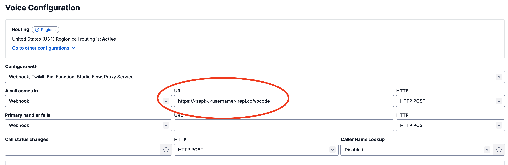

# ChatGPT Phone Call Server

Need help? Just call ChatGPT! Watch the live demo [here](https://twitter.com/chillzaza_/status/1641255992045322240?s=20).

Here's a template to get started.

Powered by [Vocode](https://docs.vocode.dev/welcome)

## Getting Started

1. Create a [Twilio](https://www.twilio.com/) account.
2. Find your account credentials under `Account Info` in the dashboard.
3. Set the environment variables `TWILIO_ACCOUNT_SID` and `TWILIO_AUTH_TOKEN` as Secrets in this Repl.
4. From your Twilio dashboard, go to `Phone Numbers` -> `Manage` to get a new phone number.
5. Update your number's configuration to point the Webhook URL to your Repl's URL (e.g. `https://<repl>.<username>.repl.co/vocode`. Here's a screenshot:
   

6. Grab an API key from Vocode [here](https://app.vocode.dev/).
7. Call your number and have fun! 🥳

**Make sure you set the following environment variables:**

## Vocode API Key

Set the environment variable `VOCODE_API_KEY` as a Secret in this Repl with your API key from [Vocode](https://app.vocode.dev/).

## Twilio Account SID

Set the environment variable `TWILIO_ACCOUNT_SID` as a Secret in this Repl with your API key from [Twilio]([https://app.vocode.dev/](https://www.twilio.com/try-twilio)).

You can find this under `Account Info` in the Twilio dashboard.

## Twilio Auth Token

Set the environment variable `TWILIO_AUTH_TOKEN` as a Secret in this Repl with your API key from [Twilio]([https://app.vocode.dev/](https://www.twilio.com/try-twilio)).

You can find this under `Account Info` in the Twilio dashboard.

## Vocode Docs

To learn more about how Vocode works, check out their [documentation](https://docs.vocode.dev/welcome).